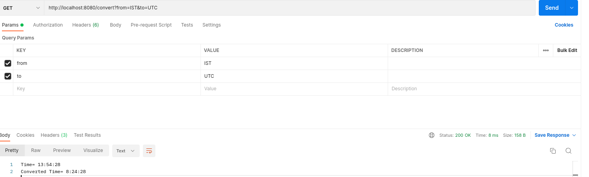

# TimeZoneApi

It is a Time zone converter APIin golang, it converts the time from one time zone to another timezone.

## Prerequisite

Please [install and set-up Golang](https://go.dev/doc/install) as well as [install and set-up Postman](https://www.postman.com/) on your system in advance.

## How to run this project?

1. Clone this Project and Navigate to the folder.

``` bash
https://github.com/k-avy/gotimezoneapi.git
cd gotimezoneapi
```

2. Build the project using following command.

```bash
go build ./cmd/time
```

3. Run the executable in your vscode terminal.

```bash
./time
```

4. You can directly run it by the following command.

```bash
go run ./cmd/time
```

5. You can see tis work on Postman on your system.

## Features

1. You can convert the current time from one time zone to another using the following address with GET Method.

```bash
 http://localhost:8080/convert?from="timezone1"&to="timezone2"
```

2. You can convert the desired time from one time zone to another using the following address with GET Method.

```bash
http://localhost:8080/converttz?from="desiredtime"_"timezone1"&to="timezone2"
```

## /convert



## /converttz


